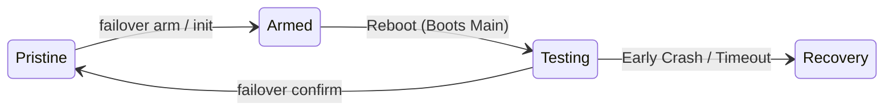

# stage1-dd

> [!WARNING]
> This project is designed for low-end VPS environments. The `failover` module directly modifies the bootloader state (EFI NVRAM / GRUB) and performs force-reboots. It has the potential to brick the bootloader or corrupt the system. USE AT YOUR OWN RISK. No warranty is provided.

A NixOS rescue environment that boots in RAM. SSH in, `dd` NixOS image onto the target disk, reboot, done.

Uses a **two-stage squashfs boot** to keep the toolset compressed in memory, achieving ~90MB post-boot RAM usage (vs ~200MB+ with a traditional cpio initrd).

## Standalone Rescue

`stage1-dd` can be used purely as a lightweight, standalone rescue environment to deploy NixOS from any existing Linux system via `kexec` or GRUB.

### Quick Start

```nix
# flake.nix
{
  inputs.stage1-dd.url = "github:you/stage1-dd";

  outputs = { self, stage1-dd, ... }: {
    packages.x86_64-linux.rescue = stage1-dd.lib.mkRescue {
      ssh = {
        authorizedKeys = [ "ssh-ed25519 AAAA..." ];
        hostKeys = [ ./path/to/ssh_host_ed25519_key ];
      };
    };
  };
}
```

```sh
nix build .#rescue
ls result/
# bzImage          14MB   kernel
# stage0.initrd     3MB   stage0 cpio (busybox + modules + init)
# stage1.squashfs  35MB   repacked NixOS initrd as squashfs
# initrd           38MB   merged (stage0 + squashfs in one cpio)
```

### `mkRescue` Options

| Option | Default | Description |
|--------|---------|-------------|
| `system` | `"x86_64-linux"` | Target architecture |
| `ssh` | `{ }` | SSH configuration attrset (`authorizedKeys`, `hostKeys`, `port`) |
| `kernelPackages` | `pkgs.linuxPackages` | Kernel package set to use |
| `extraModules` | `[]` | Additional NixOS modules to import into stage1 |

### Delivery Modes

#### Merged (single initrd)

One file to boot — ideal for GRUB, libvirt, and PXE.

**Min RAM**: ~185MB &nbsp;|&nbsp; **Post-boot**: ~90MB

```sh
qemu-system-x86_64 \
  -kernel result/bzImage \
  -initrd result/initrd \
  -append "console=ttyS0" \
  -m 256M -nographic
```

#### Separate (squashfs on disk)

Stage0 cpio is only 3MB, squashfs pages on demand from disk — lowest RAM usage.

**Min RAM**: ~128MB &nbsp;|&nbsp; **Post-boot**: ~90MB

```sh
qemu-system-x86_64 \
  -kernel result/bzImage \
  -initrd result/stage0.initrd \
  -drive file=result/stage1.squashfs,format=raw,if=virtio \
  -append "console=ttyS0" \
  -m 128M -nographic
```

#### Partition-based (root= param)

Squashfs file lives on a partition. Useful with GRUB when you can't pass a raw disk.

```sh
# Copy squashfs into an existing partition
mount /dev/vda1 /mnt
cp result/stage1.squashfs /mnt/boot/stage1.squashfs
umount /mnt

# Boot with kernel params
# root=/dev/vda1 stage1.path=/boot/stage1.squashfs
```

### GRUB Configuration

#### Merged mode

```
menuentry "NixOS Rescue" {
  linux  /boot/rescue/bzImage console=ttyS0 console=tty0
  initrd /boot/rescue/initrd
}
```

#### Separate mode (squashfs on partition)

```
menuentry "NixOS Rescue" {
  linux  /boot/rescue/bzImage console=ttyS0 console=tty0 root=/dev/vda1 stage1.path=/boot/rescue/stage1.squashfs
  initrd /boot/rescue/stage0.initrd
}
```

### Deployment via Kexec

```sh
# 1. Build the rescue environment
nix build .#rescue

# 2. Upload to rescue system (e.g. via hosting provider's recovery console)
scp result/bzImage result/initrd root@rescue-host:/boot/

# 3. Boot into the rescue kernel (provider-specific, or use kexec)
# Note: You can dynamically inject SSH keys by appending ssh_key="ssh-ed25519 AAA..." to the command-line
ssh root@rescue-host kexec -l /boot/bzImage --initrd=/boot/initrd --command-line="console=ttyS0 ssh_key=\"ssh-ed25519 AAAA...\""
ssh root@rescue-host kexec -e

# 4. Wait for rescue environment to boot, then SSH in
ssh root@target-ip

# 5. Write NixOS image to disk
curl -L https://example.com/nixos.img.zst | zstd -d | dd of=/dev/vda bs=4M status=progress

# 6. Reboot into NixOS
reboot
```

### Memory Comparison

| Mode | Min RAM (Stable Boot) | Post-boot Usage (RAM) | Notes |
|------|---------|---------------|-------|
| **Merged** (single initrd) | 256MB | ~110MB | Reliable for most VPS |
| **Separate** (virtio disk) | **128MB** | ~56MB | Extremely lean, best for low-memory |
| **Separate** (virtio disk) | 96MB | stage1 OOM | Kernel + systemd baseline limit |
| Traditional CPIO | ~256MB | ~210MB | For comparison |

## Failover

The `failover` module integrates `stage1-dd` directly into a NixOS system, providing dual-layer protection against both early-boot (kernel panics) and late-boot (network misconfiguration) failures.

### Setup

```nix
{
  imports = [ stage1-dd.nixosModules.failover ];

  services.failover = {
    enable = true;
    # Automatically injects first-boot marker on new installations
    injectMethod = "disko"; # or "script"
    rescue.ssh.authorizedKeys = [ "ssh-ed25519 AAAA..." ];
  };
}
```

> [!WARNING]
> If introducing the failover module to an **existing system** with `injectMethod = "script"`, the activation script will treat it as a fresh install and create the `first-boot.marker`. This will trigger the Watchdog and cause an unexpected reboot.
>
> To prevent this, either `touch /var/lib/failover/.initialized` *before* deployment, or immediately run `failover confirm` right after the deployment completes.

### Usage

1. Run `failover arm` before risky remote operations.
2. **Reboot**. The system attempts to boot the Main configuration exactly once.
3. If successful, run `failover confirm` to finalize and restore normal boot behavior.
4. If unreachable, wait 5 minutes (watchdog timeout) or manually hard-reboot to fallback to the Rescue environment.

### Module Options

The module exposes options under `services.failover`:

| Option | Type | Default | Description |
|--------|------|---------|-------------|
| `enable` | bool | `false` | Enable the failover subsystem |
| `injectMethod` | enum | `"disko"` | Method to auto-inject `first-boot.marker` (`"disko"`, `"script"`) |
| `watchdogTimeoutSec` | int | `300` | Seconds before watchdog reboots an unconfirmed system |
| `rescue.ssh.port` | port | `22` | SSH listen port for the rescue environment |
| `rescue.ssh.authorizedKeys` | list of str | `[]` | SSH authorized keys |
| `rescue.ssh.hostKeys` | list of path | `[]` | SSH host keys |
| `rescue.kernelModules` | list of str | `[]` | Extra kernel modules for stage1 (the rescue OS) |
| `rescue.earlyKernelModules` | list of str | `[]` | Extra kernel modules for stage0 (the squashfs loader) |
| `rescue.networkConfig` | attrs | `{ }` | `systemd.network` config to drop into the rescue OS |
| `rescue.kernelParams` | list of str | `["console=tty0" ...]` | Kernel parameters for the rescue OS |
| `rescue.extraPackages` | list of pkg | `[]` | Additional packages available in the rescue OS |
| `rescue.extraConfig` | module | `{ }` | Extra raw NixOS configuration for the rescue OS |


## Architecture

### Rescue

```
Kernel → stage0.cpio.zst (3MB)           → stage1.squashfs (35MB)
         busybox + kernel modules          full NixOS initrd (systemd)
         + ash init                        zsh, curl, dd, parted, etc.
              │
              ├── embedded in cpio ─── mount -o loop → overlayfs → switch_root
              ├── raw block device ─── mount /dev/X  → overlayfs → switch_root
              └── root= partition ──── mount fs, then loop squashfs file
```

Stage 0's init auto-detects the squashfs source:
1. **Embedded** — `/stage1.squashfs` inside the cpio (merged mode, single file delivery)
2. **Root partition** — `root=/dev/vda1 stage1.path=/boot/stage1.squashfs` kernel params
3. **Raw block device** — scans all `/dev/vd*`, `/dev/sd*`, `/dev/sr*`, `/dev/hd*`, `/dev/nvme*n*`
4. Falls back to an emergency busybox shell if nothing found

### Failover

The module isolates static NixOS configurations from dynamic runtime states via a Go CLI.



- **Pristine**: Normal state (`S_default=Main`, `S_oneshot=None`, `S_marker=False`).
- **Armed**: Protection prepared (`S_default=Rescue`, `S_oneshot=Main`, `S_marker=True`).
- **Testing**: Hardware consumes `S_oneshot` and starts Watchdog. Failures drop to Rescue (`S_default=Rescue`).
- **Recovery**: System failsafe triggered.